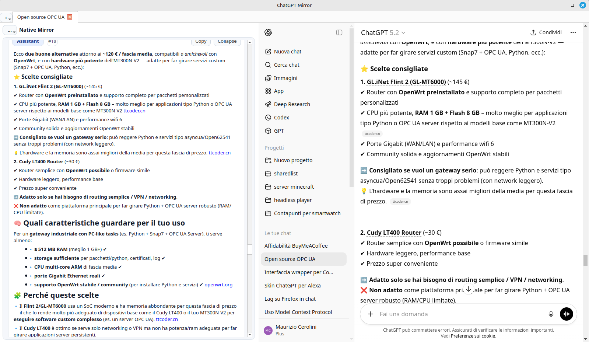

# ChatGPT Mirror

<p align="center">
  <a href="https://github.com/tekware-it/chatgpt_mirror/releases/latest">
    
  </a>
</p>

<p align="center">
  <a href="docs/screenshot-main.png">
    
  </a>
</p>

[](https://github.com/tekware-it/chatgpt_mirror/actions/workflows/ci.yml)
[](https://github.com/tekware-it/chatgpt_mirror/actions/workflows/release-builds.yml)
[](https://openai.com)
[](https://github.com/sponsors/tekware-it)

ChatGPT Mirror is a desktop app that lets you use `chatgpt.com` normally on the right side, while a native desktop viewer mirrors the rendered conversation on the left side.

It reads only what is already visible in the page DOM (no OpenAI API usage, no private endpoint calls), then turns it into a fast native list with code blocks, copy actions, exports, and offline snapshots. It also prunes older WebView DOM nodes to reduce lag on long chats and improve overall UX while keeping the native mirror as the source of truth.

## What It Is Good For

- Reading long conversations in a smoother native viewer
- Reducing WebView lag on long chats by pruning older DOM nodes
- Copying messages and code blocks quickly
- Exporting conversations to Markdown / JSON / PDF
- Keeping local offline-native snapshots of tabs
- Debugging DOM extraction while still seeing the real `chatgpt.com` page

## Main Layout

- **Left pane (Native Mirror)**: structured message viewer (`user` / `assistant`)
- **Right pane (WebView)**: embedded `chatgpt.com` for login, browsing chats, and debugging

Each app tab contains both panes.

## Native Viewer Features

- Role badge + message index
- `Copy` and `Collapse/Expand` per message
- Markdown-aware text rendering (headings, bold, lists, links)
- Code blocks extracted from DOM and rendered natively
- `Copy code` per code block
- Per-code-block `Expand/Collapse` + `Total expand`
- Optional image rendering for:
  - rich-entity images
  - gallery images

## Settings Menu (Left Pane `...`)

The `...` button in the Native Mirror header opens the settings menu.

### Browser Language

- `System`
- `English`

This controls the WebView browser language (Accept-Language) reported to `chatgpt.com`.

### Export Conversation

- `Markdown (.md)`
- `JSON (.json)`
- `PDF (.pdf)`

Default export file names use the current chat title when available.

### Code Blocks (Native)

- `Auto (collapse long blocks)`
- `Expanded`
- `Full expansion`

### Scroll

- `Auto-scroll new messages`
- `Sync Web -> Native`
- `Sync Native -> Web`

### Image Display Toggles

- `Show rich-entity images (Native + export)`
- `Show gallery images (Native + export)`

The app still extracts images from DOM even when hidden; the toggles only control native rendering/export output.

### Reset Session

Clears WebView session/cookies/cache (best effort) and reloads `chatgpt.com`.

### Advanced

- `KEEP_DOM (WebView)` pruning level
- `Allow pruned DOM restore on double-click`
- `Debug scroll sync (log)`
- `Debug visible block (.txt)`
- `Debug PDF images (.txt)`

### About

Shows:

- app version (intended to be tied to release tags)
- GitHub project link
- GitHub Sponsors link

## Tabs and Persistence

### In-app Tabs

The top-level app window supports multiple tabs.

- ChatGPT "open in new tab" actions from the embedded WebView are intercepted and opened as app tabs
- Each app tab has its own Native Mirror + WebView pair
- Tabs share the same WebEngine profile/session (same login)

There is also a `+` button in the tab bar corner with:

- `New Tab`
- `Open Local Snapshot (.sqlite)…`

### What Gets Persisted

The app stores tab/session state in a local data folder:

- open tabs list and order
- active tab index
- per-tab offline native snapshot in SQLite
- cached thumbnail bytes used by the native image widgets

On restart, the app restores:

- the same tab order
- the selected tab
- native conversation snapshots (even before the WebView reloads)

## Data Storage Location

The app uses the OS user data directory (via Qt `QStandardPaths`), so packaged builds (for example AppImage) do not try to write inside the read-only app bundle.

On Linux this is typically under a path similar to:

- `~/.local/share/<app>/...`

## Install From Source (Linux / Ubuntu 22.04)

### 1) System prerequisites (common Qt runtime fix on Ubuntu)

If Qt complains about the `xcb` platform plugin, install:

```bash
sudo apt update
sudo apt install -y libxcb-cursor0
```

If needed, install the fuller XCB runtime set:

```bash
sudo apt install -y \
  libxkbcommon-x11-0 \
  libxcb-icccm4 \
  libxcb-image0 \
  libxcb-keysyms1 \
  libxcb-randr0 \
  libxcb-render-util0 \
  libxcb-shape0 \
  libxcb-sync1 \
  libxcb-xfixes0 \
  libxcb-xinerama0 \
  libxcb-xkb1 \
  libx11-xcb1 \
  libnss3 \
  libasound2 \
  libgl1
```

### 2) Create virtualenv and install dependencies

```bash
python3 -m venv .venv
source .venv/bin/activate
python -m pip install --upgrade pip
python -m pip install -r requirements.txt
```

### 3) Run

```bash
source .venv/bin/activate
python chatgpt_mirror.py
```

## Release Builds (AppImage / Windows / macOS)

Prebuilt binaries are intended to be published on the GitHub Releases page:

- Linux AppImage
- Windows portable build / installer
- macOS `.dmg`

Release page:

- https://github.com/tekware-it/chatgpt_mirror/releases

### Build From Source (Packaging)

See `packaging/README.md` for PyInstaller + AppImage/Windows/macOS build scripts.

## Technical Notes

- The app extracts content from the rendered ChatGPT DOM using injected JavaScript (`QtWebEngine` + `QWebChannel` / console fallback).
- ChatGPT DOM selectors are best-effort and may need updates over time.
- No OpenAI API is used.
- No private endpoints are called by the app.
